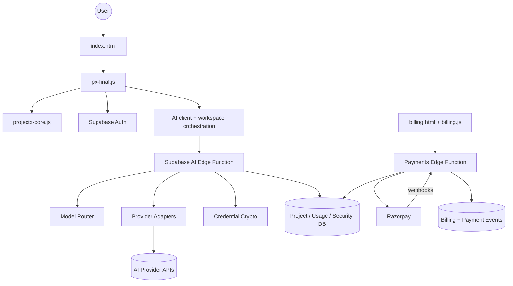

# ProjectX — Universal Creation Engine

This is the revised Builder package. It keeps the classic Builder UI language from the current PushLabs-tech/projectx interface while preserving the newer agent/model functionality.

## What is included

- Clean canonical project workspace UI
- Home, Projects and Settings navigation with project-specific workspace tools
- Discuss, Plan, Build, Visual and Research agents
- Per-agent model selection in chat
- Auto model routing with deterministic candidates and fallbacks
- Provider model discovery after credentials are added
- Bytez, OpenRouter, OpenAI, Gemini, Anthropic and OpenAI-compatible providers
- Server-side encrypted provider credential storage
- Supabase Auth + tenant-aware RLS
- Project snapshots and restore
- File viewer, preview, tests and security checks
- Custom 404, thank-you, privacy and terms pages
- Page-specific titles/descriptions and Open Graph metadata
- Favicon set, robots.txt and sitemap.xml
- Responsive mobile breakpoints + sticky mobile CTA
- Loading and form-error states
- Consent-controlled optional analytics
- Security headers for Netlify/Vercel-style hosting
- Audit logs and security events
- Razorpay subscription adapter for Pro/Max
- CI dependency audit and security scan

## Architecture

ProjectX now has one canonical browser runtime for the workspace. Older builder stacks remain in the repository only where compatibility, tests, or artifact templates still require them; they are not part of the production boot path.



Canonical browser path:
`index.html → px-final.js → projectx-core.js`

Public billing path:
`billing.html → billing.js → Supabase payments function → Razorpay`

AI path:
`px-final.js → Supabase AI function → router/providers/crypto → model provider APIs`

The workspace keeps provider-specific complexity out of normal project work. Provider credentials are tested and stored through the authenticated server-side vault, previews run in sandboxed iframes, and generated changes are verified before being marked current.

### Project Brain mutation boundary

`projectx-core.js` now includes a version-aware Brain mutation boundary (`applyBrainMutation`) and task-shaped internal helpers (`createProjectFromIntent`, `generateDiscoveryPoll`, `createPlan`, `startAgentRun`, `approveAction`, `createArtifactVersion`, `runVerification`, `getUsageSummary`).

- Mutations are operation-based (`add`, `replace`, `remove`, `mark_uncertain`) and require a matching `baseVersion`.
- Unauthorized, stale, or invalid operations are recorded in `executionState.mutationAudit`.
- Applied mutations create a new project version through the existing canonical mutation path and keep legacy compatibility projections (`intent` and `resources`) aligned with the canonical spec.
- Provenance metadata tracks source/sourceId/capturedAt/confidence/userConfirmed without storing chain-of-thought text.

## Local setup

### Requirements

- Node.js 22 LTS recommended
- Supabase CLI for backend deployment
- A Supabase project for real authentication/AI
- Provider API keys for AI use
- Razorpay merchant account only if you want subscriptions

### 1. Install

```bash
npm install
```

### 2. Configure the browser

Copy `config.example.js` to `config.js` and set:

```js
window.BUILDER_CONFIG = {
  SUPABASE_URL: "https://YOUR_PROJECT.supabase.co",
  SUPABASE_PUBLISHABLE_KEY: "YOUR_SUPABASE_PUBLISHABLE_KEY",
  GA_MEASUREMENT_ID: "",
  SITE_URL: "https://YOUR-DOMAIN.example"
};
```

Only publishable/client-safe values belong here.

### 3. Start

```bash
npm run dev
```

Open the local Vite URL.

## Supabase setup

1. Create a Supabase project.
2. Run `supabase/schema.sql` in the SQL Editor or convert it into your normal migration workflow.
3. Run `supabase/migrations/002_security_billing.sql`.
4. Set Edge Function secrets.
5. Deploy the AI function.
6. Configure Auth email settings and your site/redirect URL.

Recommended secrets:

```text
AI_CREDENTIALS_ENCRYPTION_KEY
SUPABASE_SERVICE_ROLE_KEY (or the current Supabase secret-key equivalent)
RAZORPAY_KEY_ID
RAZORPAY_KEY_SECRET
RAZORPAY_WEBHOOK_SECRET
RAZORPAY_PRO_PLAN_ID
RAZORPAY_MAX_PLAN_ID
```

Never commit `.env` or real secrets.

## AI provider setup

Use **Settings → AI** after signing in. A key is sent over HTTPS to the authenticated Edge Function. The function validates the provider, discovers models, encrypts the credential, and stores only masked metadata for the UI.

Use the default-model selector in **Settings → AI**. ProjectX keeps provider/model details out of the normal project workflow.

See `SETUP-AI.md` for the complete provider setup and routing behavior.

## Payments

Open `billing.html` after completing `SETUP-PAYMENTS.md`.

The payment integration intentionally requires your own merchant credentials. No fake production payment success is implemented.

## Hosting

The project can be hosted as a static site plus Supabase Edge Functions. `netlify.toml`, `_headers` and `vercel.json` provide security-header examples for hosts that support them.

GitHub Pages does not let a repository define arbitrary HTTP response headers. If you deploy there, put the header policy at a reverse proxy/CDN or use a host that supports response headers.

## Security model

- Signed-in provider credentials are encrypted and stored server-side; guest Gemini BYOK is intentionally kept only in sessionStorage and never synced.
- Provider credentials are encrypted before persistence.
- Credential table is backend-only.
- AI and payment functions require authenticated users for user operations.
- Payment webhooks use HMAC signature verification.
- RLS and grants are both part of the database hardening; policies alone are not treated as sufficient.
- Project build operations accept only safe relative file paths.
- Build/Visual outputs are explicit file operations; arbitrary shell execution is not supported.
- Project previews use a sandboxed iframe.
- No `eval()`/`new Function()` execution is used by the local security/test scanner.
- Audit logs and payment-event idempotency records are included.

## Verification

```bash
npm run check
npm run security:scan
npm run check
```

CI also runs `npm audit --audit-level=high`.

## Required launch configuration

Before production, you must replace:

- `YOUR_SUPABASE_URL`
- `YOUR_SUPABASE_PUBLISHABLE_KEY`
- `YOUR-DOMAIN.example`
- `GA_MEASUREMENT_ID` if analytics is desired
- Razorpay plan IDs/secrets if subscriptions are desired
- the contact address in the legal pages/configuration

A real contact address cannot be safely invented; use the actual address for the business/operator before publishing the legal pages.

## V9 Universal Creation Layer

V9 expands the workspace from an app-builder prototype into a universal creation workbench. The UI now includes adaptive creation types, an AI interviewer, blueprints, Project Brain concepts, specialist agents, a first-class Resource Center, capability/tool surfaces, workflows, Data Studio, code workspace, tests/security/runs, release control, advanced AI/BYOK entry points, templates, integrations, analytics, versioning, and autonomous-run controls.

AI providers are intentionally abstracted from the normal workflow. Advanced AI settings are the optional place for a user to connect a provider/API key. Raw credentials must remain server-side; do not place secrets in frontend files.

The current ZIP is a frontend/workspace foundation. Features that require production infrastructure (durable workflow workers, browser sandboxes, multi-tenant cloud persistence, realtime collaboration, full deployment orchestration, live payment verification, and complete document/mobile/game runtimes) need backend implementation before being treated as production-complete.


## Current release
The canonical runtime includes adaptive specialist assembly, Project Brain, Live Architecture, Outcome readiness, Explain Why, Make it Great, Optimize, Transform, version compare/restore/fork, source-backed research, resource ingestion, responsive preview, safe file editing, provider model discovery, approval gates, usage/security views, and consent-gated analytics.

Before publishing: configure Supabase/domain/provider credentials, deploy backend functions/migrations, verify auth redirects, and run `npm run check && npm run security:scan`.
